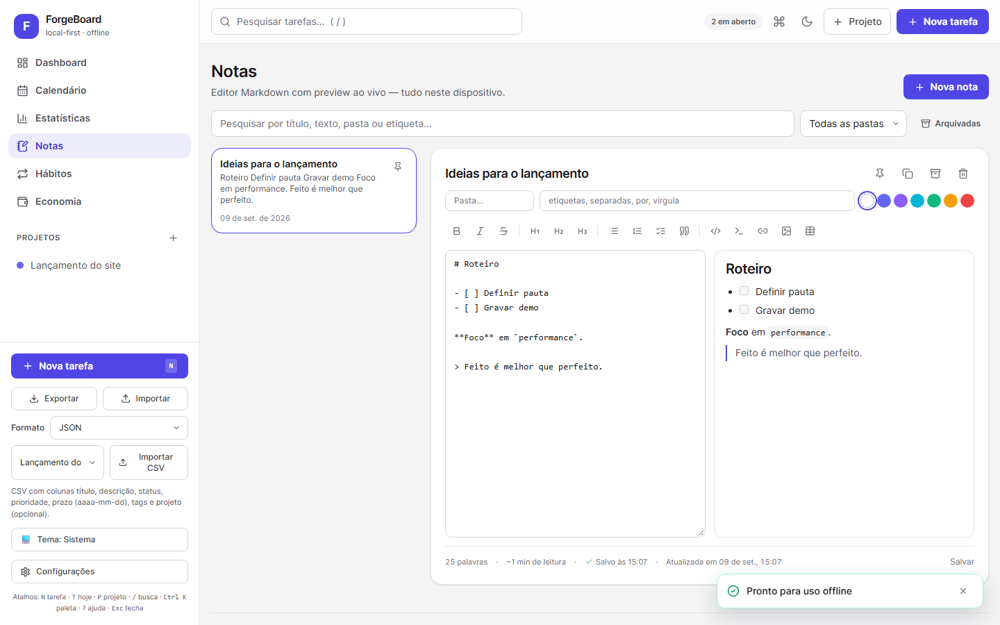
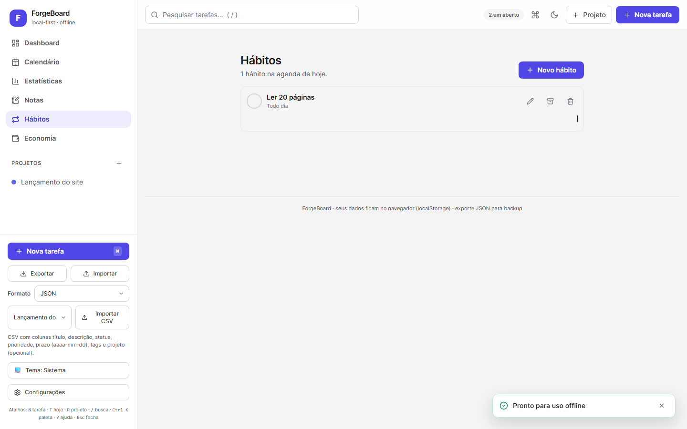
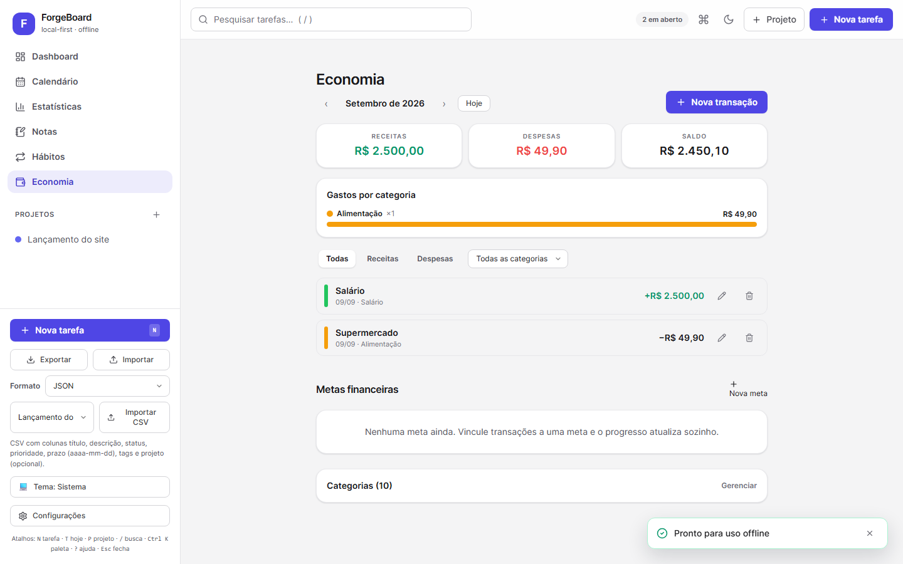
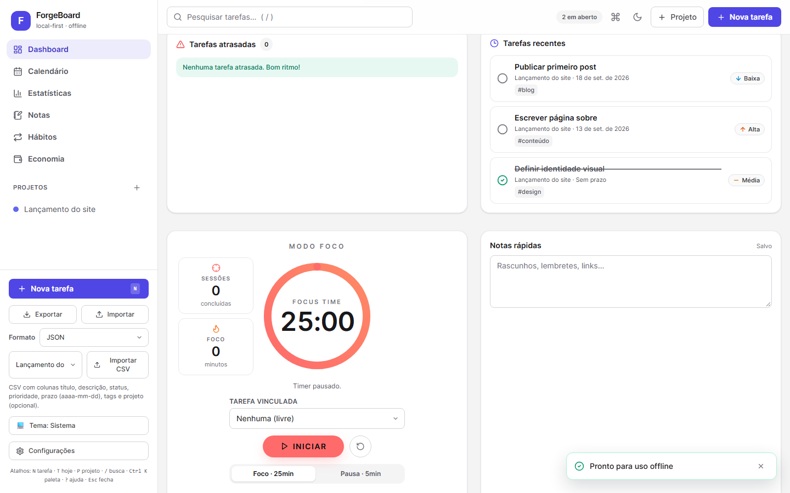
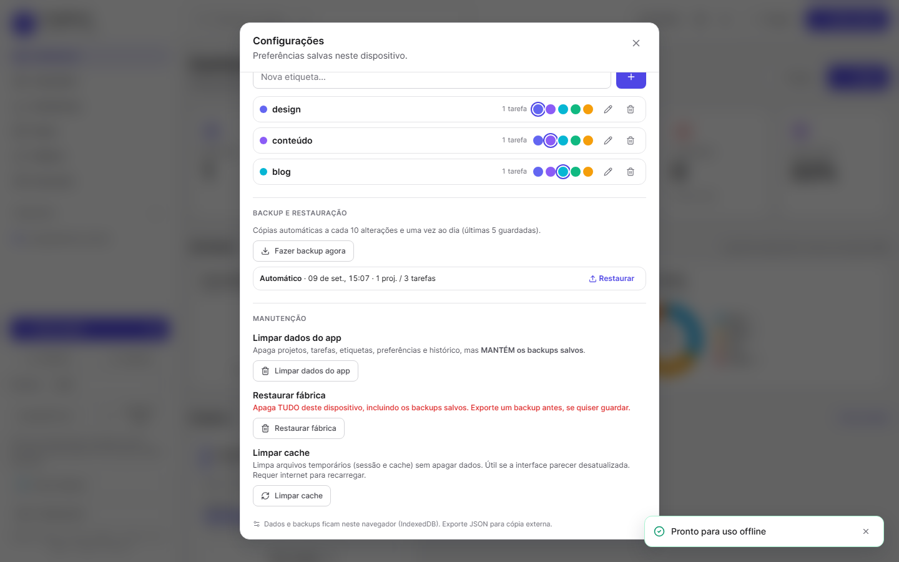

# ForgeBoard

[](https://github.com/aliefauzifauzieali-svg/ForgeBoard/actions/workflows/ci.yml)
[](https://github.com/aliefauzifauzieali-svg/ForgeBoard/releases/latest)

Suíte de produtividade pessoal **local-first**: roda 100% no dispositivo, sem
backend, sem contas, sem sincronização. Dados em IndexedDB (com quarentena +
backups), PWA instalável, apps desktop (Tauri) e Android (Capacitor) com
auto-update, tema claro/escuro e interface em pt-BR.

## Funcionalidades

- **Tarefas e projetos**: Kanban (Backlog → Em andamento → Concluído) com
  arrasto por Pointer Events (mouse e toque), prioridades, prazos, etiquetas
  com cores, subtarefas com progresso e recorrência
  (diária/semanal/mensal/personalizada).
- **Dashboard**: estatísticas, widget Hoje (vencendo hoje + sugestão
  inteligente), atrasadas, recentes, resumos de hábitos e economia.
- **Calendário** mensal/semanal/diário com drag and drop de prazos.
- **Notas Markdown**: editor com preview ao vivo, toolbar completa, pastas,
  etiquetas, fixar, arquivar e duplicar.
- **Hábitos** diários/semanais com check-in, grade de 30 dias e widget.
- **Economia**: receitas/despesas mensais, categorias personalizáveis, metas
  financeiras com progresso automático e widget de saldo.
- **Modo Foco (Pomodoro 25/5)** com vínculo de tarefa, histórico de sessões
  e notificações locais de prazo.
- **Produtividade**: paleta de comandos (`Ctrl+K`) + busca global,
  atalhos de teclado, desfazer/refazer, modelos de projeto, importação/
  exportação JSON versionada, CSV/Markdown, gráficos SVG próprios e página
  de Estatísticas com métricas históricas.

## Screenshots

> Geradas com `node scripts/capture-screenshots.mjs` (após `npm run build`).

| Dashboard | Quadro Kanban |
|---|---|
|  |  |

| Calendário | Estatísticas |
|---|---|
|  |  |

| Notas (editor Markdown) | Hábitos |
|---|---|
|  |  |

| Economia | Modo Foco |
|---|---|
|  |  |

| Configurações (Manutenção) | Mobile |
|---|---|
|  |  |

| Modo escuro |
|---|
|  |

## Stack

| Camada | Tecnologia |
|---|---|
| UI | React 19 + TypeScript |
| Build | Vite 8 |
| Estilo | Tailwind CSS 3 (modo escuro via classe) |
| Estado | Zustand |
| Ícones | Lucide React |
| Datas | date-fns (cálculos + locale pt-BR) |
| Dados | IndexedDB via `idb` (`fake-indexeddb` nos testes) |
| Testes unitários | Vitest + Testing Library + jsdom |
| Testes E2E | Playwright (Chromium) + axe-core |
| PWA | vite-plugin-pwa (generateSW, manifest, offline) |
| Lint | oxlint |

## Estrutura do projeto

```
ForgeBoard/
├── e2e/                      # Testes E2E (Playwright)
│   ├── helpers.ts            # resetBoard, seedBoard, createProject…
│   ├── projects.spec.ts
│   ├── tasks.spec.ts
│   ├── palette.spec.ts
│   ├── calendar.spec.ts
│   ├── tags.spec.ts
│   ├── data.spec.ts
│   ├── stats.spec.ts
│   ├── notes.spec.ts
│   ├── habits.spec.ts
│   ├── finance.spec.ts
│   ├── maintenance.spec.ts
│   ├── pwa.spec.ts
│   ├── responsive.spec.ts
│   ├── a11y.spec.ts
│   └── persistence.spec.ts
├── src-tauri/                  # app desktop (Tauri v2: frontend.rs, updater)
├── android/                    # app Android (projeto Capacitor versionado)
├── src/
│   ├── components/           # UI burra/reutilizável
│   │   ├── kanban/           # KanbanBoard, KanbanColumn, usePointerDrag (arrasto por Pointer Events)
│   │   ├── layout/           # Sidebar, TopBar, BottomNav (mobile)
│   │   ├── projects/         # ProjectCard, ProjectModal
│   │   ├── tasks/            # TaskCard, TaskRow, TaskModal, TaskFiltersBar
│   │   ├── settings/         # SettingsModal (tema, atalhos, etiquetas, backup)
│   │   ├── charts/           # SVG próprios (barras, rosca, linhas — sem lib)
│   │   └── ui/               # Modal, ConfirmDialog, Toasts, banners, PWA…
│   ├── features/             # Seções com regra de negócio
│   │   ├── dashboard/        # estatísticas, projetos, atrasadas, recentes + widgets (Hoje, hábitos, economia)
│   │   ├── palette/          # paleta de comandos + busca global
│   │   ├── calendar/         # mês/semana/dia + DnD de prazos (date-fns)
│   │   ├── stats/            # página de Estatísticas + métricas
│   │   ├── project/          # visão do projeto + Kanban filtrado
│   │   ├── notes/            # editor Markdown (lista + workspace, toolbar, pastas)
│   │   ├── habits/           # hábitos + grade de 30 dias
│   │   ├── finance/          # economia (transações, categorias, metas)
│   │   └── focus/            # Modo Foco (Pomodoro + sessões)
│   ├── pages/                # wrappers finos sobre features
│   ├── hooks/                # atalhos, focus trap
│   ├── stores/               # board, UI, tema, prefs, notas, hábitos, economia (Zustand, API síncrona)
│   ├── types/                # Project, Task, Tag, BoardData, filtros…
│   ├── services/             # pura: stats, calendar, query, validation, boot…
│   ├── storage/              # idb + boardStorage + migrations + activity
│   ├── utils/                # id, datas, constantes, cn()
│   └── tests/                # testes unitários Vitest + setup (+fixtures/)
├── playwright.config.ts
├── vite.config.ts            # + config do Vitest
└── tailwind.config.js
```

## Instalação (usuário)

Baixe o instalador da [**última release**](https://github.com/aliefauzifauzieali-svg/ForgeBoard/releases/latest):

| Plataforma | Arquivo |
|---|---|
| Windows | `ForgeBoard_*_x64-setup.exe` (ou `.msi`) |
| Linux | `.AppImage` / `.deb` / `.rpm` |
| macOS | `.dmg` (Apple Silicon) |
| Android | `forgeboard-v*.apk` |
| Navegador | PWA instalável a partir de qualquer host estático de `dist/` |

## Instalação (desenvolvimento)

Pré-requisitos: **Node.js 20+** e npm.

```powershell
cd ForgeBoard
npm install
npm run dev        # http://127.0.0.1:5173
```

Primeira execução para E2E (baixa o Chromium):

```powershell
npm run test:e2e:install
```

## Comandos disponíveis

| Comando | O que faz |
|---|---|
| `npm run dev` | servidor de desenvolvimento |
| `npm run build` | `tsc -b` + build de produção (`dist/`) |
| `npm run preview` | serve o build de produção |
| `npm run typecheck` | apenas `tsc -b` |
| `npm run lint` | oxlint |
| `npm run test` | testes unitários (Vitest, run único) |
| `npm run test:watch` | Vitest em modo watch |
| `npm run test:e2e` | Playwright dev (sobe o `dev` sozinho via `webServer`) |
| `npm run test:e2e:pwa` | Playwright contra o build (`preview`): manifest, SW, offline, update |
| `npm run tauri:dev` | app desktop em desenvolvimento (exige Rust) |
| `npm run tauri:build` | instaladores desktop em `src-tauri/target/release/bundle/` |
| `npm run android:sync` | copia `dist/` + config para o projeto Android |
| `npm run android:open` | abre o projeto no Android Studio |
| `npm run android:build` | gera o APK de debug (`android/app/build/outputs/apk/debug/`) |
| `npm run android:build:win` | mesmo build via `.\gradlew` (PowerShell/Windows) |

## Instalação Desktop (Tauri — Windows/Linux/macOS)

Pré-requisitos: Node.js 20+ e o toolchain **Rust estável** (`rustup`), além das
dependências de sistema do [guia Tauri](https://v2.tauri.app/start/prerequisites/)
(WebView2 no Windows 10/11 — já incluso no Windows 11; WebKitGTK no Linux).
No Windows, instale via winget (toolchain verificada: Rust 1.98.1):

```powershell
winget install --id Rustlang.Rustup -e --silent --accept-package-agreements
#toolchain MSVC (link.exe) vem com o Visual Studio 2022 + workload C++
```

```powershell
npm install
npm run tauri:dev    # janela desktop apontando para o Vite em dev
npm run tauri:build  # instaladores em src-tauri/target/release/bundle/
```

Saídas: Windows (`.msi` + `.exe` NSIS), macOS (`.dmg` + `.app`), Linux (`.deb` + `.AppImage`).
O frontend é o mesmo `dist/` do PWA — nenhuma lógica muda; o armazenamento
continua em IndexedDB/localStorage dentro da WebView.

## Instalação Android (Capacitor — APK)

Pré-requisitos: Node.js 20+, **JDK 21** e **Android SDK** (cmdline-tools +
platform-tools + uma platform Android), com `ANDROID_HOME`/`ANDROID_SDK_ROOT`
apontando para o SDK. No Windows, instale via winget (toolchain verificada:
Temurin JDK 21.0.12, SDK com platform android-36 + build-tools 35):

```powershell
winget install --id EclipseAdoptium.Temurin.21.JDK -e --silent --accept-package-agreements
#Android Studio (traz o SDK): winget install --id Google.AndroidStudio -e
setx JAVA_HOME "C:\Program Files\Eclipse Adoptium\jdk-21.0.12.101-hotspot"
setx ANDROID_HOME "$env:LOCALAPPDATA\Android\Sdk"
#Reabra o terminal para herdar as variáveis.
```

```powershell
npm install
npm run build
npm run android:sync    # copia dist/ para android/app/src/main/assets
npm run android:build   # APK debug em android/app/build/outputs/apk/debug/
```

Alternativa sem linha de comando: `npm run android:open` e Build > Build APK no
Android Studio. Offline funciona porque os assets vão empacotados no APK;
IndexedDB/localStorage persistem entre reinicializações. Nota: na WebView o
service worker pode não registrar (esquema próprio do Capacitor) — irrelevante
aqui, pois nada é buscado da rede; o `pwa.ts` trata a falha em silêncio.

## Atualizações automáticas

A versão instalada aparece em Configurações > Sobre (nome, versão do bundle
desktop ou do package.json, link das releases e verificação de update).

### Desktop (Tauri, assinado)

O app verifica `latest.json` no GitHub Releases ao iniciar (silencioso) e em
Configurações > Atualizações (botão "Verificar atualização" + "Instalar e
reiniciar", com progresso). Pacotes verificados por assinatura minisign.

- Chave: gerada com `tauri signer generate`; a pública está em
  `tauri.conf.json` (`plugins.updater.pubkey`); a privada vive nos secrets
  `TAURI_SIGNING_PRIVATE_KEY[_PASSWORD]` do repositório (nunca no código).
- O workflow de release assina os bundles e publica `latest.json` junto aos
  instaladores (Windows: `-setup.exe`; Linux: `.AppImage`; macOS: `.app.tar.gz`).
- Teste manual: instale uma versão antiga, publique tag maior, abra o app —
  o toast indica a nova versão; instale por Configurações e confirme a versão.
- Empacotamento: a janela abre `forgeboard://localhost/index.html`, servido
  da pasta `%APPDATA%\com.forgeboard.desktop\frontend\` via protocolo
  customizado (`src-tauri/src/frontend.rs`, anti-traversal + MIME). No
  primeiro boot (ou com versão divergente), a pasta é populada dos recursos
  embutidos e carimbada com `version.json`; o binário continua instalável
  offline normalmente.
- Atualização incremental: Configurações > Atualizações baixa
  `forgeboard-web-<tag>.zip` da release, extrai, valida (`index.html`),
  troca com backup (restaura em erro) e recarrega — sem reinstalar o `.exe`,
  sem admin. O instalador completo (.msi/-setup.exe) segue existindo para
  primeira instalação e mudanças nativas (Rust).
- Origem e dados: a página roda em `http://forgeboard.localhost`
  (contexto seguro: IndexedDB, módulos ES e fetch funcionam). Na estreia, o
  IndexedDB da origem antiga (`http_tauri.localhost`) é copiado uma vez;
  localStorage recomeça (tema/cor/timer se reconfiguram sozinhos).
- Teste manual: feche o app, apague a pasta `frontend`, abra de novo (ela é
  recriada da versão do bundle); publique tag maior e atualize por
  Configurações > Atualizações.
- Service worker **só no navegador** (`initPWA` pula o registro no Tauri e no
  Capacitor nativo). Registrar o SW no shell desktop fazia o workbox servir
  shell antigo após upgrades (prova: `workbox-precache-v2-http://tauri.localhost/`
  no perfil WebView2), congelando a UI na versão anterior mesmo com binário
  novo. Se uma instalação antiga travou assim: abra o app, clique em
  "Atualizar" no toast "Nova versão disponível" — ou desinstale e instale a
  release atual (o perfil WebView2 antigo vai junto).

### Android (Capacitor, OTA via GitHub Releases)

O app verifica `latest.json` da release (`seção android`) em Configurações >
Atualizações do Android: se houver bundle web mais novo, baixa e aplica no
restart (sem reinstalar o APK). O mesmo manifesto traz `apkUrl` para baixar
o APK completo manualmente (aí sim o Android pede confirmação).

- O CI empacota `dist/` em `forgeboard-web-<tag>.zip` e publica junto à
  release; nenhum servidor extra é necessário.
- Sem seção `android` no manifesto (releases antigas), a tela informa que
  não há atualização configurada e nenhuma rede é tocada além do GET.
- Quando migrar para um servidor Capgo dedicado, preencha
  `ANDROID_UPDATE_URL` em `src/services/updateServer.ts` e chame
  `CapacitorUpdater.notifyAppReady()` no boot (evita rollback do bundle).

## Nova versão (release automática)

O workflow `.github/workflows/release.yml` gera instaladores Windows/Linux/macOS
(Tauri) + APK Android (Capacitor) a cada tag `v*`:

```powershell
#1. Sincronize a versão do app com a tag (4 arquivos: package.json,
#   src-tauri/tauri.conf.json, src-tauri/Cargo.toml, src-tauri/Cargo.lock)
#2. Commit, tag e push — o resto é automático:
git tag v1.9.0
git push origin main v1.9.0
#3. Acompanhe em Actions > Release; os artefatos vão para a release do GitHub.
```

Também dá para disparar manualmente em Actions > Release > Run workflow
(`workflow_dispatch`). iOS fora de escopo.

## Como executar os testes

```powershell
npm run test          # testes unitários (Vitest)
npm run test:e2e      # testes E2E no Chromium (dev + mobile)
npm run test:e2e:pwa   # E2E do PWA contra o build (SW, offline, update)
```

Cobertura unitária (~290 testes): tarefas, Kanban, filtros, busca global, undo/redo, calendário, notas (CRUD, fixar, pastas, Markdown), hábitos, economia (transações, metas, categorias), timer PRO, PWA, persistência + quarentena, importação/exportação, métricas e etiquetas. E2E (~79 testes): projetos, tarefas, paleta, calendário, notas, hábitos, economia, estatísticas, etiquetas, backup/restore, manutenção, PWA/offline, axe (todas as visões), quarentena e fluxos mobile.

## Atalhos de teclado

| Tecla | Ação |
|---|---|
| `N` | nova tarefa (herda o projeto aberto) |
| `T` | nova tarefa com o prazo de hoje |
| `P` | novo projeto |
| `/` | focar pesquisa |
| `Ctrl/⌘+K` | paleta de comandos e busca global (funciona em qualquer lugar) |
| `Ctrl/⌘+Z` | desfazer última alteração |
| `Ctrl/⌘+Shift+Z` ou `Ctrl+Y` | refazer alteração desfeita |
| `?` | abrir lista de atalhos |
| `Esc` | fechar modal / confirmação / paleta / menu mobile |

Teclas simples ignoradas enquanto o foco está em `input`, `textarea`, `select` ou conteúdo editável — e também quando qualquer modal/confirmação está aberto (só `Esc` age). `Ctrl/⌘+Z` em campos de texto mantém o comportamento nativo do navegador.

## Robustez dos dados

- **Validação no boot**: `loadInitialData` aplica migrações e as mesmas regras da importação. Payload ausente, malformado ou inválido resulta em board vazio — e o conteúdo bruto é preservado na **quarentena**, com banner oferecendo baixar a cópia, restaurar backup ou descartar.
- **ErrorBoundary**: qualquer erro de render mostra tela de recuperação com exportação de backup antes de recomeçar.
- **Falha de persistência**: se o IndexedDB falhar (cota excedida, modo privado), um banner avisa e oferece exportar backup — nada se perde em silêncio.
- **CI** (`.github/workflows/ci.yml`): typecheck → lint → testes → build → E2E a cada push/PR.

## Decisões arquiteturais importantes

1. **Camada de armazenamento isolada** (`src/storage/`): a UI nunca toca storage diretamente. Hoje há o IndexedDB (`idb.ts`: `kv` + `backups`) com migrações versionadas (`migrations.ts`); o `localStorage` serve só de espelho do tema e quarentena. Um backend futuro implementa o mesmo repositório (`loadInitialData`/`persistSnapshot`) sem reescrever componentes — só o store passa a chamar o serviço remoto. Stores partem vazios e são hidratados explicitamente no boot (`services/boot.ts`), sem I/O no momento do import.
2. **Lógica pura fora dos componentes** (`src/services/`): estatísticas, filtros/ordenação e validação de import são funções puras, 100% testáveis sem React. Stores e componentes apenas orquestram.
3. **Dois stores Zustand com papéis distintos**: `useBoardStore` (dados de domínio + persistência) e `useUIStore` (visão, filtros, modais). Tema em `useThemeStore` com preferência `light|dark|system` persistida e `matchMedia` para o modo sistema.
4. **Drag-and-drop por Pointer Events em vez de biblioteca**: caminho único para mouse e toque (fantasma do cartão, alvo por geometria, Esc cancela), com botões “Mover para coluna anterior/próxima” como alternativa operável por teclado; overlay de captura trava scroll/seleção durante o arrasto no mobile.
5. **Validação defensiva na importação**: `validateBoardData` nunca lança — retorna `{ ok, errors, data }`; nada é substituído sem passar na validação **e** sem confirmação explícita do usuário (`ConfirmDialog`).
6. **Sem roteador**: navegação por estado (`view: dashboard | project | calendar | stats | notes | habits | finance`), suficiente para app local de página única e evita dependência extra; E2E não depende de URLs.
7. **Tailwind v3 + `darkMode: 'class'`**: modo escuro robusto e testável, incluindo `color-scheme` no `<html>`.
8. **Dados em camadas**: store síncrono em memória (a UI nunca espera I/O) + `IndexedDB` assíncrono (`idb`, 1 KB) com flush no `pagehide`; `localStorage` só espelha tema/quarentena. Migrações versionadas e idempotentes; backups automáticos + manuais com retenção de 5.
9. **Log de atividades append-only** (`activity` no mesmo banco, com índices): eventos de domínio com metadados mínimos (títulos para entidades excluídas, sem snapshots); bulk (import/undo/seed usa lote próprio) não polui métricas; retenção de 90 dias com poda no boot; leitura via `use()` + Suspense com cache invalidado na escrita.

## Limitações atuais

- Persistência limitada à cota do IndexedDB do navegador e a um único dispositivo — sem sincronização.
- Sem colaboração em tempo real, anexos ou contas de usuário (fora do escopo local-first).
- Drag-and-drop por Pointer Events (sem físicas de biblioteca como dnd-kit); botões “Mover” seguem como alternativa.
- Sem migração automática além de `v1 → v3` (versões futuras desconhecidas vão para quarentena em vez de migrar).

## Possíveis melhorias futuras

- [ ] Backend opcional (REST/Supabase/Firebase) implementando o repositório de dados + sincronização e resolução de conflitos.
- [x] Apps desktop (Tauri, com auto-update assinado) e Android (Capacitor, com OTA).
- [x] Notas Markdown, hábitos, economia e timer PRO.
- [x] Migrações versionadas de schema (`v1 → v3`).
- [x] Subtarefas com progresso (sem comentários/anexos).
- [x] Visões de calendário (mês/semana/dia) com drag and drop de prazos.
- [x] Recorrência de tarefas (diária/semanal/mensal/personalizada).
- [x] Busca global com paleta de comandos (`Ctrl/⌘+K`), filtro `#etiqueta`, ranking e destaque, e atalhos (`?` lista todos).
- [ ] Sincronização multi-dispositivo (quando houver backend).
- [x] PWA instalável.
- [x] Exportação CSV/Markdown e importação de CSV.
- [x] Testes de acessibilidade automatizados (axe) no CI.
